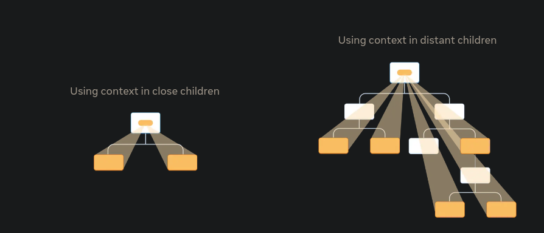

#  Image Gallery with React Context

A React application that demonstrates the use of Context API for managing image sizes across multiple components without prop drilling.



##  Overview

This project showcases how to use React's Context API to share state (image size) between components efficiently. Users can toggle between small and large image sizes using a checkbox, and the change propagates through the entire component tree via context.

##  Features

- **Dynamic Image Sizing**: Toggle between 100px and 150px image sizes
- **Context API Implementation**: Efficient state management without prop drilling
- **Clean Component Architecture**: Well-separated components with single responsibilities
- **Responsive Design**: Smooth image size transitions

##  Project Structure

```
src/
├── App.jsx           # Main component with context provider
├── List.jsx          # Displays list of places
├── Place.jsx         # Individual place component
├── PlaceImage.jsx    # Image rendering component
├── data.jsx          # Sample places data
├── utils.jsx         # Utility functions (getImageUrl)
└── ImagePass.jsx     # Context definition
```

##  Components

### App Component
- Provides the `ImagePass` context to the entire application
- Manages the `isLarge` state for image size toggle
- Renders the control interface and main list

### List Component
- Consumes the image size from context using `useContext` hook
- Maps through the places data and renders individual place items

### Place Component
- Displays place name and description
- Renders the associated image with proper sizing

### PlaceImage Component
- Handles image rendering with dynamic width and height
- Uses the `getImageUrl` utility function for image sources

##  Code Implementation

### Context Setup
```jsx
// ImagePass.jsx
import { createContext } from 'react';
const ImagePass = createContext(100);
export default ImagePass;
```

### State Management
```jsx
const [isLarge, setIsLarge] = useState(false);
const imageSize = isLarge ? 150 : 100;
```

### Context Consumption
```jsx
const imageSize = useContext(ImagePass);
```

##  Getting Started

### Prerequisites
- Node.js (version 14 or higher)
- npm or yarn

### Installation

1. **Clone the repository**
   ```bash
   git clone <repository-url>
   cd project-directory
   ```

2. **Install dependencies**
   ```bash
   npm install
   ```

3. **Start the development server**
   ```bash
   npm start
   ```

4. **Open your browser**
   Navigate to `http://localhost:3000`

##  How to Use

1. The application will display a list of places with images and descriptions
2. Check the "Use large images" checkbox to increase image sizes to 150px
3. Uncheck the box to return to 100px images
4. Observe how all images update simultaneously through context

##  Key Technologies

- **React 18+** - UI library
- **Context API** - State management
- **React Hooks** - useState, useContext
- **JavaScript ES6+** - Modern JavaScript features

##  Learning Objectives

This project demonstrates:
-  Creating and providing React Context
-  Consuming context with useContext hook
-  Avoiding prop drilling
-  Managing global state in React applications
-  Component composition patterns
-  Dynamic styling based on state

##  Customization

### Adding New Places
Update the `places` array in `data.jsx`:
```jsx
export const places = [
  {
    id: 0,
    name: "New Place",
    description: "Description here",
    imageId: "IMAGE_ID"
  },
  // ... more places
];
```

### Modifying Image Sizes
Change the size values in App.jsx:
```jsx
const imageSize = isLarge ? 200 : 80; // Custom sizes
```
